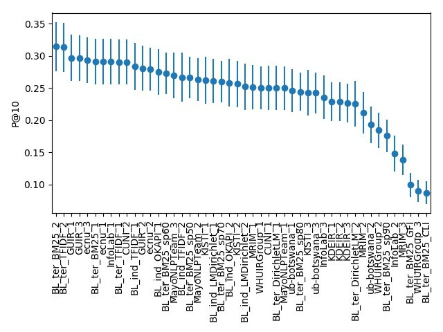
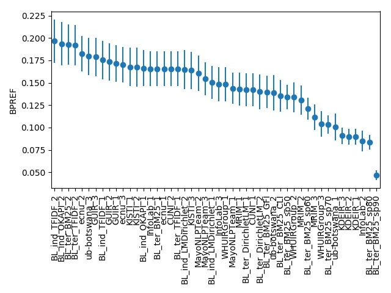
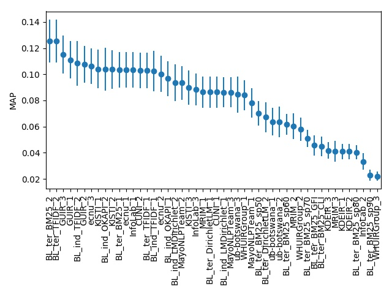

# CLEFeHealth2016Task3

[Task Website](https://sites.google.com/site/clefehealth2016/task-3)

Official repository for the CLEF 2016 eHealth Lab, IR Task. 
This task is a continuation of the previous CLEF eHealth information retrieval (IR) tasks that ran in 2013, 2014 and 2015 
and embraces the TREC-style evaluation process, with a shared collection of documents and queries, 
the contribution of runs from participants and the subsequent formation of relevance assessments and evaluation of 
the participants submissions.

This year's IR task will continue the growth path identified in 2014, abd 2015's CLEF eHealth information retrieval challenges. 
The 2016 task uses the new web corpus (ClueWeb12 B13).

The task is structured into three subtasks:

__IRTask 1:  ad-hoc search__

Queries for this task are generated by mining health web forums to identify example information needs. This task extends the evaluation framework used in 2015 (which considered, along with topical relevance, also the readability of the retrieved documents) to consider further dimensions of relevance such as the reliability of the retrieved information.

__IRTask 2: query variation__

This task explores query variations for an information need. Different query variants are generated for the same forum entry, thus capturing the variability intrinsic in how people search when they have the same information need. Participants should take these variations into account when building their systems: participants will be told which queries relate to the same information need and they have to produce one set of results to be used as answer for all query variations of an information need. We aim to foster research into building systems that are robust to query variations.

__IRTask 3: multilingual search__

This task, similar to last year, offers parallel queries in several languages (Czech, French, Hungarian, German, Polish and Swedish).

## Results:

### Task 1 Results:

The following graphs were obtained using the scripts kepts in *python_scr* path.
Bars shows 95% confidence interval.

__P@10:__

__BPref:__

__MAP:__

